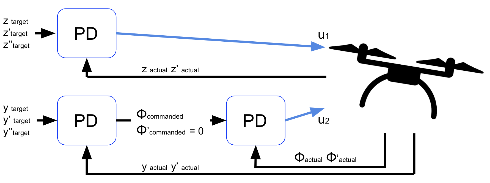

## Udacity Project: 2D Linear Cascaded Control

#### Overview:

This workbook shows my solution for a 2-D linear PD cascaded controller with feedforward control for a quadcopter drone 

#### 2-D Free Body Diagram 
# 

#### 2-D Linear PD Cascaded Controller 
# 

